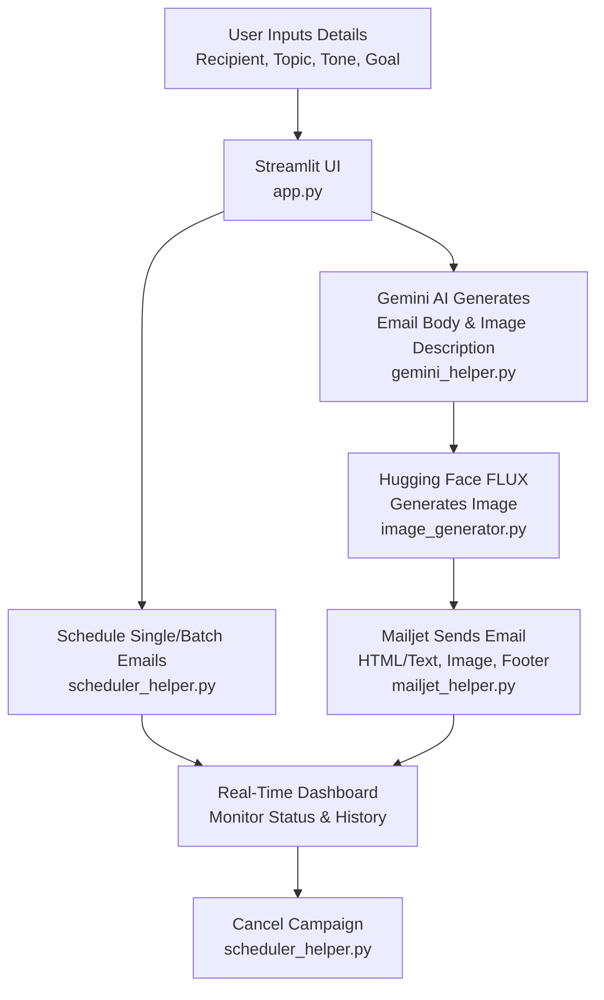

# AI Outreach Automation Tool 🚀

This application automates the creation and delivery of personalized emails with AI-generated content and custom images. Users provide minimal input, and the tool handles everything from drafting emails to scheduling and tracking campaigns. It’s designed to save time, boost productivity, and ensure consistent, engaging communication.

---

## 🎯 What the Project Does
The **AI Outreach Automation Tool** generates and sends personalized emails with relevant images, all powered by artificial intelligence. Users input basic details like recipient, topic, tone, and goal, and the tool creates complete email content, including a custom image tailored to the message. It supports single emails, batch scheduling, and campaign management with a real-time dashboard.

---

## 🌍 Real-World Problem It Solves
Crafting thoughtful outreach, reminders, or follow-ups is time-consuming and challenging, especially for busy professionals or businesses managing large contact lists. This tool eliminates manual effort by:
- **Automating** email creation with AI-generated, personalized content.
- **Simplifying** image selection with AI-generated visuals.
- **Streamlining** scheduling and tracking for single or bulk email campaigns.
- **Ensuring** compliance with legal requirements like CAN-SPAM and GDPR.

---

## 💡 How It Reduces Human Effort
Instead of drafting emails or searching for images, users:
1. Fill in a simple form with recipient details, topic, and tone.
2. Let AI generate the email body, signature, and relevant images.
3. Schedule single or batch emails and monitor progress via a dashboard.

This saves hours of manual work, ensures timely communication, and prevents missed follow-ups.

---

## 📂 Project Structure
```
outreach-ai-app/
├── app.py                      # Streamlit UI and workflow controller
├── requirements.txt            # Python dependencies
├── .env                        # Environment vars (API keys, sender info)
├── helper/
│   ├── gemini_helper.py        # Gemini AI logic for email and image description
│   ├── prompt_templates.py     # Parameterized prompt templates for AI
│   ├── image_generator.py      # Hugging Face image generation
│   ├── mailjet_helper.py       # Email sending with Mailjet
│   └── scheduler_helper.py     # Batch scheduling and campaign management
├── README.md                   # This file
└── (other support/test scripts as needed)
```

### File Roles
- **`app.py`**: Streamlit-based UI; collects user input, triggers AI modules, previews emails, and manages scheduling/dashboard.
- **`helper/gemini_helper.py`**: Interfaces with Gemini AI to generate complete email bodies and image descriptions.
- **`helper/prompt_templates.py`**: Stores parameterized AI prompt templates for consistent email generation.
- **`helper/image_generator.py`**: Uses Hugging Face’s FLUX model to create images based on AI descriptions.
- **`helper/mailjet_helper.py`**: Sends emails via Mailjet with HTML/text formatting, embedded images, and legal footers.
- **`helper/scheduler_helper.py`**: Manages single/batch email scheduling, campaign grouping, and status tracking.
- **`requirements.txt`**: Lists Python dependencies like `streamlit`, `mailjet-rest`, `apscheduler`, etc.

---

## ✨ Key Features
- **AI-Powered Emails**: Input recipient, topic, tone, and goal; get fully personalized emails with no blanks. 📧
- **Custom Image Generation**: AI creates relevant images for each email, auto-described or manually specified. 🖼️
- **Batch Scheduling**: Send emails to multiple recipients from CSV/Excel files with "Names" and "Emails" columns. 📊
- **Real-Time Dashboard**: Monitor campaign schedules, statuses, and send history in the Streamlit sidebar. 📈
- **HTML Email Rendering**: Preserves line breaks, signatures, and embeds images. 📄
- **Legal Compliance**: Includes CAN-SPAM/GDPR-compliant footers with unsubscribe links. ✅
- **Campaign Management**: Cancel future sends and auto-clean completed campaign statuses. 🗑️

---

## 🛠️ Project Development Steps

### 1. Environment Setup
- Install **Python 3.9+** and set up a virtual environment:
  ```bash
  python -m venv venv
  source venv/bin/activate  # On Windows: venv\Scripts\activate
  ```
- Install dependencies:
  ```bash
  pip install -r requirements.txt
  ```

### 2. Core Integration
- Create a `.env` file in the project root with the following:
  ```env
  GEMINI_API_KEY=your_gemini_api_key
  HUGGINGFACE_API_KEY=your_huggingface_api_key
  MAILJET_API_KEY=your_mailjet_api_key
  MAILJET_SECRET_KEY=your_mailjet_secret_key
  SENDER_EMAIL=your_verified_email@example.com
  SENDER_NAME=Your Name
  COMPANY_ADDRESS=Your Company Address
  ```
- Obtain API keys from [Gemini](https://ai.google.dev/), [Hugging Face](https://huggingface.co/), and [Mailjet](https://www.mailjet.com/).

### 3. AI Modules
- **Email Generation**: Gemini AI creates complete email bodies based on prompt templates in `prompt_templates.py`.
- **Image Description**: Gemini suggests image descriptions from email context or accepts manual input.
- **Image Creation**: Hugging Face’s FLUX model generates images, saved and attached/embedded in emails.

### 4. Email Delivery
- Configure Mailjet with verified sender email and SPF/DKIM authentication.
- Send multipart HTML/text emails with proper formatting, embedded images, and legal footers.

### 5. Batch Scheduling & Tracking
- Use `apscheduler` to schedule single or batch emails with customizable intervals.
- Track campaigns in the dashboard, group jobs by campaign ID, and allow cancellation.

### 6. Multi-Recipient Import
- Upload CSV/Excel files with "Names" and "Emails" columns.
- Validate file format before scheduling to prevent errors.

### 7. User Experience & Compliance
- Collect sender’s name, role, and contact details via Streamlit form.
- Append AI-generated or user-defined professional signatures.
- Ensure all emails include company address and unsubscribe links for CAN-SPAM/GDPR compliance.

---

## 🛠️ Flowchart of Procedure


---

## 🔍 Troubleshooting & Solutions
| **Issue** | **Solution** |
|-----------|--------------|
| "Missing ... positional argument" error | Double-check function calls in code for required arguments. |
| Emails landing in spam | Verify sender domain in Mailjet, use SPF/DKIM, and ensure professional language. |
| Attachments/images not in email | Confirm file paths and encoding in `mailjet_helper.py`. |
| API quota errors | Switch to backup provider or wait for quota reset. |
| Newlines lost in email | Use `<br>` tags in HTML email content. |
| Scheduler not cancelling campaigns | Call `cancel_campaign(campaign_id)` from UI; verify job grouping. |
| Emails have blanks/[____] text | Ensure all prompt placeholders are filled before AI request. |

---

## 🚀 Getting Started
1. Clone the repository:
   ```bash
   git clone https://github.com/your-repo/outreach-ai-app.git
   cd outreach-ai-app
   ```
2. Set up the environment and `.env` file as described above.
3. Install dependencies:
   ```bash
   pip install -r requirements.txt
   ```
4. Run the app:
   ```bash
   streamlit run app.py
   ```
5. Open your browser to `http://localhost:8501` and start creating campaigns!

---

## 🛠️ Technologies Used
| **Technology** | **Icon** |
|----------------|----------|
| Streamlit      | 🌐       |
| Gemini AI      | 🤖       |
| Hugging Face   | 🖼️       |
| Mailjet        | 📧       |
| APScheduler    | ⏰       |
| Python         | 🐍       |

This project leverages free/open APIs to deliver a powerful, user-friendly solution for AI-driven email outreach. Happy automating! 🎉